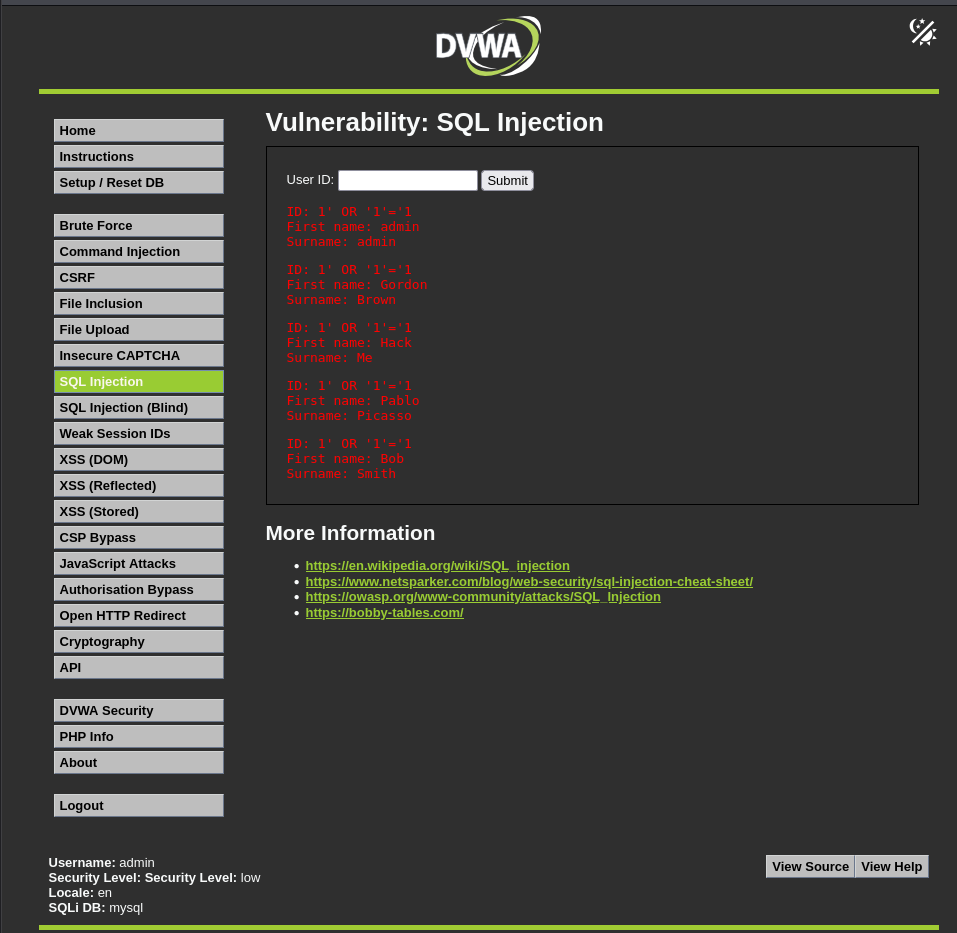
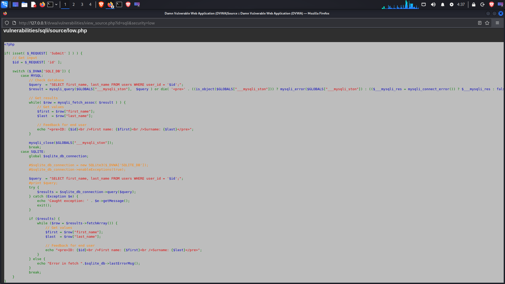
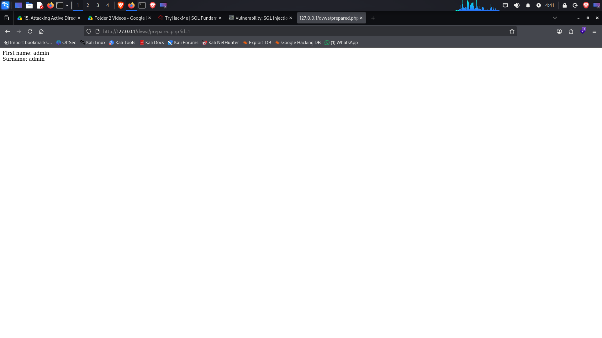

# SQL Injection

## Overview

SQL Injection is a web application vulnerability that occurs when user-controlled input is directly incorporated into an SQL query without proper parameterization.

This exercise was performed against the SQL Injection module of Damn Vulnerable Web Application (DVWA) in a controlled local laboratory environment.

---

## Lab Environment

- Kali Linux
- Apache HTTP Server
- PHP
- MariaDB
- Damn Vulnerable Web Application (DVWA)
- Firefox Web Browser

### Target

```
http://127.0.0.1/dvwa/
```

All testing was performed against the local DVWA instance.

---

## Objective

The objectives of this exercise were:

- Identify a SQL Injection vulnerability.
- Demonstrate the effect of crafted SQL input.
- Inspect the vulnerable source code.
- Understand how user input is incorporated into the SQL query.
- Examine the use of prepared statements as a safer approach.

---

## 1. SQL Injection Demonstration

The DVWA SQL Injection module was tested by providing crafted input through the `User ID` parameter.

The application returned multiple user records instead of restricting the response to the expected record.

This demonstrated that the supplied input was being interpreted as part of the SQL query.

### Evidence



**Evidence:** `31-sql-injection.png`

The screenshot shows the SQL Injection test and the resulting records returned by DVWA.

---

## 2. Source Code Analysis

The DVWA source code was inspected to understand the cause of the vulnerability.

The vulnerable implementation directly incorporates the value received from the HTTP request into the SQL query.

The relevant query follows this structure:

```
SELECT first_name, last_name FROM users WHERE user_id = '$id';
```

The `$id` value originates from user-controlled request data and is directly inserted into the SQL statement.

Because the input is not separated from the SQL syntax, specially crafted input can alter the intended behavior of the query.

### Evidence



**Evidence:** `32-sqli-source.png`

The screenshot shows the relevant DVWA source code responsible for processing the SQL Injection request.

---

## 3. Prepared Statements

Prepared statements provide a safer approach for handling user-controlled values in SQL queries.

Instead of directly inserting user input into the SQL statement, the query is defined separately and the input is supplied as a parameter.

A simplified example is:

```
$stmt = $db->prepare(
    "SELECT first_name, last_name FROM users WHERE user_id = ?"
);

$stmt->bind_param("i", $id);
$stmt->execute();
```

The parameter is treated as data rather than being interpreted as part of the SQL syntax.

### Evidence



**Evidence:** `33-prepared-statement.png`

The screenshot shows the prepared-statement example examined during the exercise.

---

## 4. Vulnerability Analysis

### Root Cause

The vulnerability occurs because user-controlled input is directly incorporated into an SQL query.

The application does not properly separate the SQL statement from the supplied input.

### Potential Impact

In a vulnerable application, SQL Injection can potentially allow an attacker to manipulate database queries and access or modify data beyond the application's intended behavior.

The actual impact depends on the application's database permissions, query structure, and available functionality.

---

## 5. Mitigation

Recommended mitigations include:

1. Use prepared statements with parameterized queries.
2. Avoid directly concatenating user input into SQL queries.
3. Perform appropriate server-side input validation.
4. Use database accounts with the minimum privileges required by the application.
5. Avoid exposing sensitive database errors to users.
6. Perform security testing against application input parameters.

The primary mitigation demonstrated in this exercise was the use of prepared statements.

---

## 6. Evidence Summary

| Evidence | Description |
|---|---|
| `31-sql-injection.png` | SQL Injection demonstration |
| `32-sqli-source.png` | Vulnerable SQL query source code |
| `33-prepared-statement.png` | Prepared-statement approach |

---

## Conclusion

The SQL Injection vulnerability was successfully demonstrated in the local DVWA laboratory environment.

The exercise showed how directly incorporating user-controlled input into an SQL query can alter the intended behavior of the application.

Source-code analysis identified the vulnerable query construction, while the prepared-statement example demonstrated a safer method for handling database parameters.

All testing was performed against the local DVWA environment.
```

